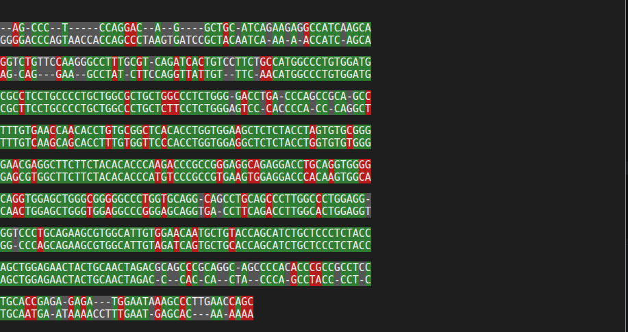

# Alinhador de Sequências de DNA (Needleman-Wunsch)

Implementação do zero do algoritmo de alinhamento global de sequências (Needleman-Wunsch), aplicada a dados biológicos reais baixados do NCBI. Projeto de entrada na área de bioinformática, focado em entender — e não só usar — o algoritmo por trás de ferramentas como o BLAST.

## O que o projeto faz

1. Baixa sequências reais de mRNA do NCBI (via Biopython/Entrez)
2. Implementa o algoritmo de Needleman-Wunsch em Python puro, sem bibliotecas prontas de alinhamento
3. Gera uma visualização colorida do resultado (verde = match, vermelho = mismatch, cinza = lacuna)

## Exemplo

Alinhamento entre o gene da insulina em humano (`INS`) e em camundongo (`Ins2`):



- Humano: 491 bases · Camundongo: 485 bases
- Pontuação do alinhamento: 239
- Identidade: 72,9%

## Tecnologias

- Python 3
- [Biopython](https://biopython.org/) — acesso ao NCBI e parsing de FASTA
- Algoritmo de alinhamento implementado do zero

## Como rodar

```bash
git clone <url-do-seu-repositorio>
cd bio-alinhador
python3 -m venv venv
source venv/bin/activate
pip install biopython

python3 baixar_sequencias.py   # baixa as sequências do NCBI
python3 alinhador.py           # roda o alinhamento e gera alinhamento.html
```

